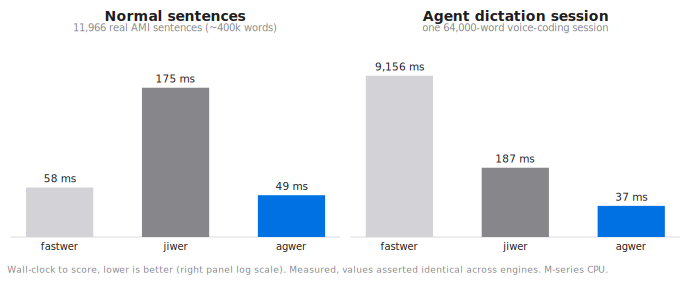
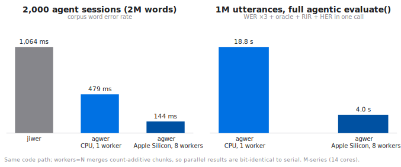

# Benchmarks

All numbers on this page are measured, not estimated, on the current
release: **agwer 0.4.9**, against jiwer 4.0.0 and fastwer 0.1.3, on an
Apple Silicon M-series machine (14 cores). The harnesses live in our
development repository, every engine receives identical strings, and WER
agreement across engines is asserted before any timing. The page always
reports the current version; the per-version performance history stays
with the harnesses.

## Long-context ASR: engine scaling with document length

Long-form ASR (meetings, podcasts, earnings calls) is scored at the
document level, and per-pair edit distance is quadratic in document
length. That quadratic term is where engines part ways. The data is real:
NVIDIA Canary 1-best decodes of AMI meeting speech (5,469 segments, 22.2%
corpus WER), concatenated into documents of a target length with total
workload held at ~400k reference words per row, so any time growth comes
purely from document length (minimum of 3 runs):

| words per document | documents | fastwer (C++ DP) | jiwer | **agwer** |
|---|---|---|---|---|
| 25 | 11,966 | 58 ms | 175 ms | **49 ms** |
| 250 | 1,544 | 161 ms | 161 ms | **50 ms** |
| 1,000 | 397 | 502 ms | 165 ms | **59 ms** |
| 4,000 | 100 | 1,968 ms | 209 ms | **79 ms** |

Three observations:

1. **Plain dynamic programming does not survive long documents.**
   fastwer's classic O(n·m) DP grows ~35× as documents go from 25 to
   4,000 words at constant total workload. The bit-parallel engine
   underneath agwer and jiwer processes alignment columns 64 at a time,
   and agwer additionally runs banded (below), so it grows only ~1.6×.
2. **agwer and jiwer share the same C++ kernel (RapidFuzz), and agwer's
   thinner layer shows.** agwer calls the distance kernel directly on
   pre-tokenized batches; jiwer builds a full alignment per call. Same
   results (asserted bit-identical), roughly 3× less overhead.
3. **agwer leads at every document length**, including the short end
   where lean DP used to be competitive.

## Extreme case: one voice-coding dictation session (1k to 64k words)

Dictating to a coding agent produces the hardest scoring workload: one
continuous session-length document. This benchmark scores a single seeded
synthetic session (package names and commands mixed with English glue,
technical terms split into heard words, ~20% WER) as one document
(median of 5):

| session length | fastwer (C++ DP) | jiwer | **agwer** | vs jiwer | vs fastwer |
|---|---|---|---|---|---|
| 1,000 words | 1.3 ms | 0.34 ms | **0.10 ms** | 3.4× | 13× |
| 4,000 words | 21.2 ms | 1.94 ms | **0.49 ms** | 4.0× | 43× |
| 16,000 words | 499 ms | 15.7 ms | **3.5 ms** | 4.5× | 143× |
| 64,000 words | 9,156 ms | 187 ms | **37.3 ms** | 5.0× | 245× |

Character error rate on the same 64,000-word session (~345k characters):
**agwer 433 ms vs jiwer 4,151 ms (9.6×)**, values identical.

Two observations:

1. **Quadratic DP is disqualified at session length.** A long dictation
   session costs fastwer 9.2 seconds per scoring call; the bit-parallel
   engines stay far under 200 ms. If your evaluation loop rescores after
   every agent edit, that is the difference between interactive and not.
2. **Auto-banding is where agwer's widening lead comes from.** Above 256
   elements, agwer starts the distance computation in an Ukkonen-style
   band sized by an error-rate prior instead of the full DP width; the
   band doubles until the true distance provably fits, so every result
   stays exact — pinned by tests from 0% to 100% error rates. Typical
   ASR corpora gain 2–10×; a pathological corpus (~90% error) pays about
   1.3×. Short utterances below the gate take the plain path.

## Large-batch evaluation: many entries

The complementary axis to document length: entry count. The workload is
the real 30-session WSJ corrector batch (the same records as the
[example dataset](https://huggingface.co/datasets/huckiyang/agwer_asr_batch_test_v0))
replicated to size — short utterances, many entries, the LLM-output
batch regime (median of 3):

| entries | fastwer | jiwer | agwer (strings) | **agwer (pre-tokenized)** | agwer `workers=8` |
|---|---|---|---|---|---|
| 10,020 | 12 ms | 58 ms | 16 ms | **3 ms** | 67 ms |
| 100,020 | 117 ms | 861 ms | 289 ms | **33 ms** | 113 ms |
| 1,000,020 | 1,153 ms | 8,681 ms | 2,834 ms | **339 ms** | 655 ms |

On short entries the per-call cost is tokenization, not edit distance:
materializing a million Python token lists dwarfs the C-level alignment
(fastwer avoids it by fusing tokenize+DP inside C++, which is why it
leads the plain string column at scale). agwer's answer is to let you pay
that cost **once**: every word-level measure accepts pre-tokenized
`list[list[str]]` input directly.

```python
import agwer

refs_tok = [agwer.tokenize(s) for s in refs]   # once per corpus
hyps_tok = [agwer.tokenize(s) for s in hyps]

agwer.wer(refs_tok, hyps_tok)   # identical value, no per-call tokenization
agwer.ser(refs_tok, hyps_tok)   # mer / wil / wip work the same way
```

Tokenize once and every subsequent scoring call runs 3.4 to 4x faster
than fastwer at every scale, single-threaded. This is exactly the shape
of an agent evaluation loop: the corpus is fixed, the outputs change, and
rescoring should not re-pay tokenization. (Normalize before tokenizing;
the fast path requires `normalize=None` so the two can never silently
disagree.)

The number the comparison cannot show: the **full agentic evaluation**
(three WERs, both oracles, RIR, HER) over the same 1M entries × 5-best
runs in **4.0 s** with `workers=8`. No other engine computes those
quantities at all.

## agwer on CPU and Apple Silicon

The single-worker column is the portable CPU path: pure RapidFuzz, the
same code any x86 or ARM machine runs. On Apple Silicon, agwer
additionally ships native `arm64-darwin` wheels and scales across
performance cores with `evaluate(..., workers=N)`, since every aggregate
it computes is count-additive and merges exactly — parallel results are
bit-identical to serial.

Long-form workload (1,000-word documents, ~2M reference words, full
`evaluate()`):

| setup | time | speedup |
|---|---|---|
| CPU path, single worker | 0.73 s | 1.0× |
| Apple Silicon, 4 workers | 0.26 s | 2.8× |
| Apple Silicon, 8 workers | **0.18 s** | **4.0×** |

Short-utterance workload (1M utterances × 5-best, full agentic
evaluation):

| setup | time | speedup |
|---|---|---|
| single worker | 18.8 s | 1.0× |
| 8 workers | **4.0 s** | 4.7× |

Reproduce the in-package benchmark on your own machine:

```bash
python -m agwer.bench --workers 8
```

## How it got fast

Four exact-by-construction optimizations compound across this page, each
gated on bit-identical outputs before release: the **auto-banded
distance** (Ukkonen band with doubling, long inputs), **pre-tokenized
batch input** (pay tokenization once per corpus), **shared-reference DP
reuse** in the agentic pipeline (the n-best is normalized, tokenized, and
aligned once; 1-best distances, oracle pick, and the compositional-oracle
vocabulary are views over that pass), and an **ASCII fast path in the
default normalizer** (C-level translate replacing two regex passes,
derived from the same regex so the output cannot differ). The per-version
measurement history lives with the harnesses in the development
repository.

## The same numbers as charts



agwer is the fastest engine in both regimes, and the gap widens exactly
where agents live: long dictation sessions. On Apple Silicon the same
count-additive design then scales across performance cores with
`workers=N`, with results bit-identical to a single worker:


